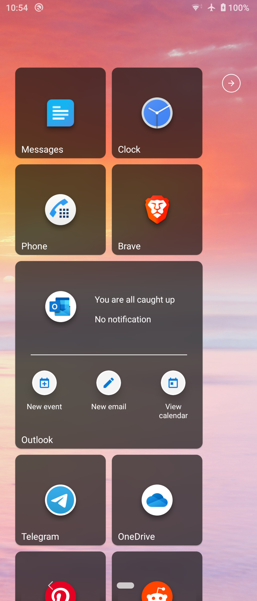
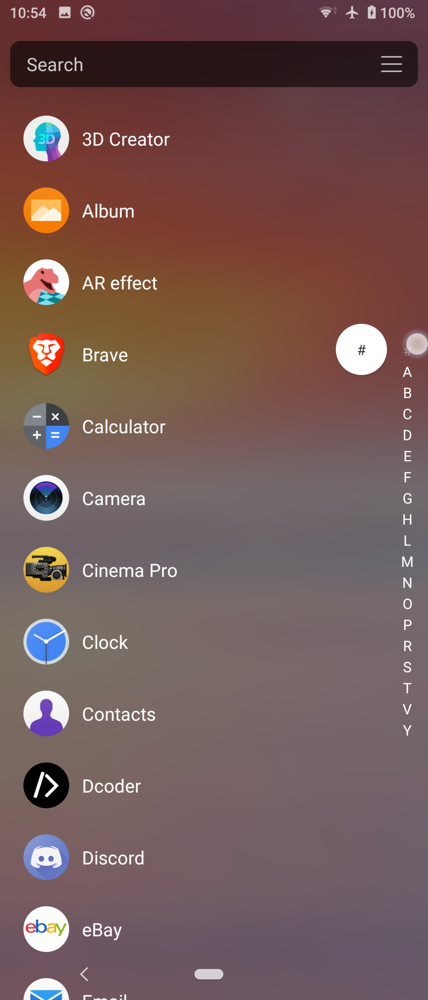
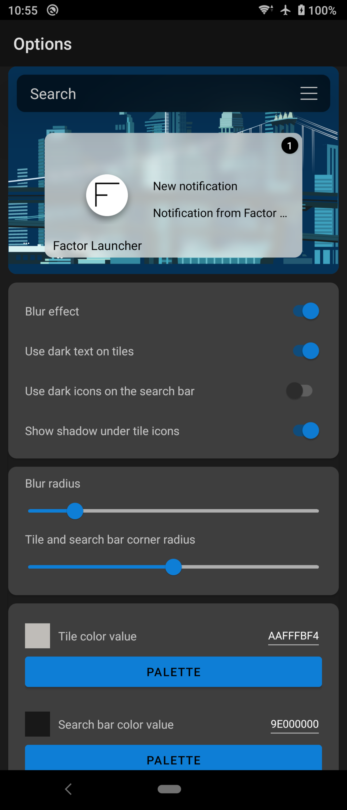
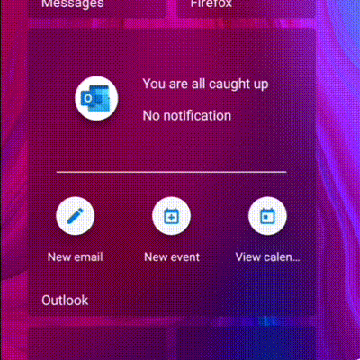

# Factor Launcher

Factor Launcher is an upcoming Android Launcher inspired by the original Windows Phone 7 design, supporting Android 6.0 to 12

(App shortcuts are not supported on devices running Android 7.0 and below since shortcuts were introduced in Android 7.1)

Please uninstall the GitHub apk versions before downloading from the Play Store. 

Join us on [Telegram](https://t.me/joinchat/GHNyjTyxQ3BwLxom)

[Development playlist](https://youtube.com/playlist?list=PLr2SUHRsQtUdnRM6PRxuPIfK48T5HyNsX)

[Newest video demo](https://youtu.be/AFXJ_Sbj8iU)

&nbsp;

    

# Version 0.64.4

- medium and large tiles now display more notification content
- fixed full screen display on devices running Android 11 and above
- app shortcuts are now sorted based on functionality 
- updated dependencies 

 

&nbsp;

# My Other Projects

[Bouncy](https://github.com/Valkriaine/bouncy/blob/master/README.md) - Add IOS-like overscroll animation to your scrolling views.

[Mutify](https://github.com/Valkriaine/Mutify) - Automatically turn on do-not-disturb based on where you are

# Contact Me

[Email Me](mailto:valkriaine@hotmail.com)

[My YouTube Channel](https://www.youtube.com/channel/UC8deY7v1W_NH3I5_f9ZVscw)
